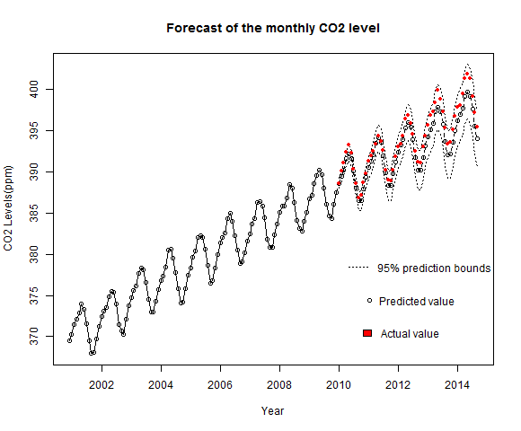

# Time-Series-CO2-Prediction
Time Series analysis of the global carbon dioxide (CO2) levels with R

## R Libraries    
- forecast  
- TSA
- tseries
- readxl

## Problem
Use Time Series techniques to analyze the Earth's CO2 levels and identify a suitable model to fit the data and predict the future CO2 levels.

## Data
Concentrations of CO2 in the Earth's atmosphere (parts per million) derived from in situ air measurements at the Mauna Loa Observatory, Hawaii. The measurements at Mauna Loa form the longest, continuous, high-precision record of CO2 levels in the atmosphere. The time period is from March 1958 to September 2014. More information can be referred to the excel file or CO2Now.org.

## Results
The Seasonal ARIMA Model fit to the training data has a mean squared error of 1.3 parts per million (ppm) for the predictions on the test data from 2010 to 2014. Also, 96% of the test data falls within the 95% prediction bounds of the model.

  

